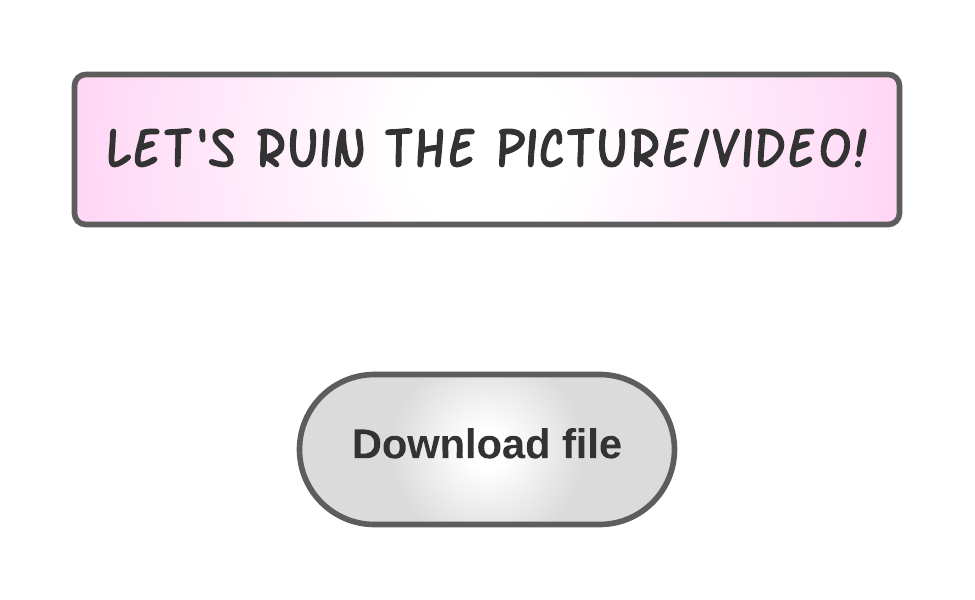
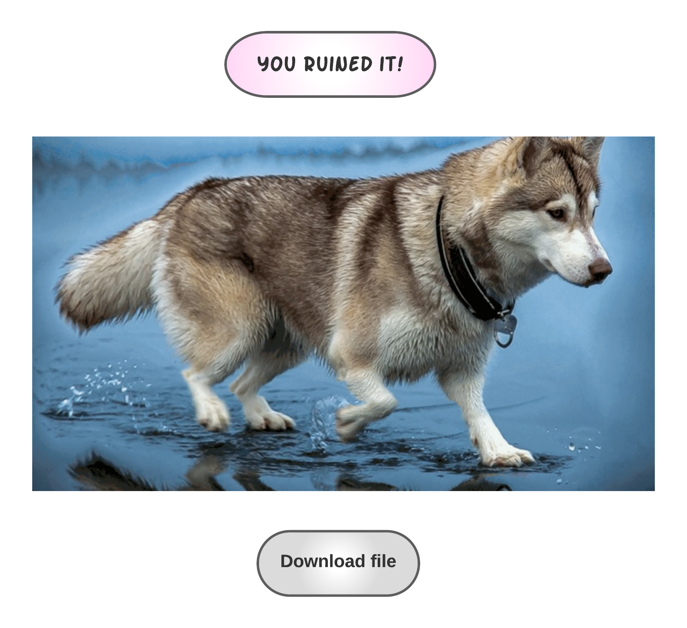

# Sea-Bottle-Jackal

## Искажение изображений (алгоритм Seam carving)

_Задача:_ получение из изображения искаженного изображения (видео).

### Возможности искажателя

* Загрузка изображения через web и получение искаженного изображения/видео на выходе с возможностью скачивания;
* Искажение изображения и его сохранение с помощью командной строки.
* Пример работы алгоритма:

До:


После:


## Зависимости

* ```fastapi```
* ```numpy```
* ```cv2```

## Пользовательские интерфейсы

* web-интерфейс на HTML, CSS, JS;
* серверный интерфейс (```fastapi```);
* интерфейс командной строки.

### Макет web-интерфейса

Страница загрузки файла:



Страница с результатом и возможностью скачивания:




### Серверный интерфейс

Пользователь может отправить POST-запрос, содержащий бинарный файл с изображением и получить результат работы в виде бинарного файла.

### Интерфейс командной строки

```python -m jackalify [-h] [-w] [-g] [-o OUTPUT_PATH] [input_path]```

Если не указан флаг ```-g```, то создастся статичная картинка. Также если не указано имя выходного файла, то искажённое изображение (или gif) будет создано рядом с исходной картинкой. Если не указан флаг ```-w```, то обязательно наличие входного файла, однако если флаг ```-w``` указан, никакие другие аргументы не должны присутствовать.

options:

* ```-h``` - помощь
* ```-w``` - запуск серверного интерфейса (fastapi), опционально
* ```-o``` - имя выходного файла, опционально
* ```-g``` - создание gif вместо статичной картинки, опционально
* ```input_path``` - путь к файлу с оригинальным изображением, опционально

#### Примеры:

* ```python -m jackalify wolf.png -o wolf-jackal.png``` - получение искаженного изображения ```wolf-jackal.png```
* ```python -m jackalify wolf.png``` - получение искаженного изображения ```wolf_jackalified.png```
* ```python -m jackalify wolf.png -o wolf-jackal.gif -g``` - получение искаженного видео ```wolf-jackal.gif```
* ```python -m jackalify -w``` - запуск серверного интерфейса
